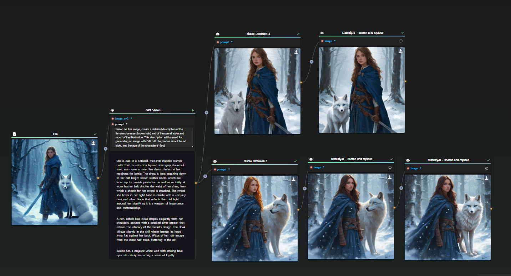
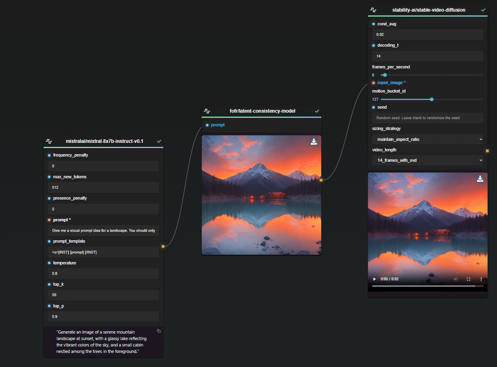
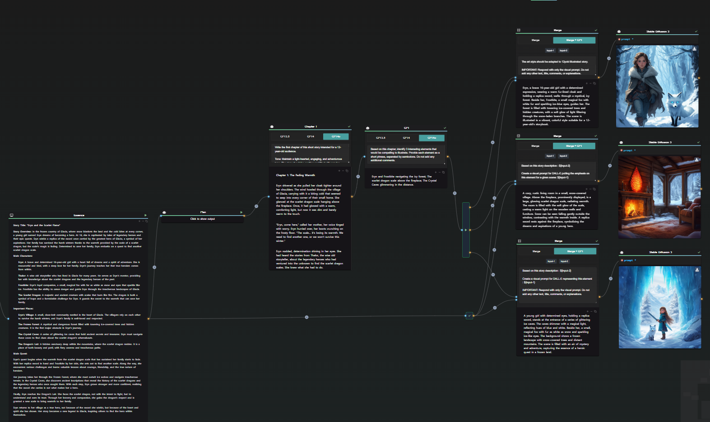

  

  <em>Open-source tool to seamlessly connect multiple AI model APIs in repeatable flow.</em>

    
    
    
    
    

<a href="https://ai-flow.net/?ref=github">🔗 Website</a>
 | 
<a href="https://docs.ai-flow.net/?ref=github">📚 Documentation</a>

## 🎉🚀 v0.8.1 is Now Available 🚀🎉

🚀 **New Nodes : Claude 3, StabilityAI API, Data Splitter update**

✨ **Layout Mode Updated**
 
 

---

**AI Flow** is an open source, user-friendly UI application that empowers you to seamlessly connect multiple AI models together, specifically leveraging the capabilities of multiples AI APIs such as OpenAI, StabilityAI and Replicate.

## Features

In a nutshell, AI Flow provides a visual platform for crafting and managing AI-driven workflows, thereby facilitating diverse and dynamic AI interactions.

- 🎨 It offers a drag-and-drop interface to design these workflows
- 📊 Monitors their execution in real-time
- 🚀 Nodes are launched in parallel whenever possible
- 🗂️ AI models can be conveniently managed and organized
- 💾 Workflows can be exported or imported for sharing or backup purposes

## Models availables

- Every model hosted on Replicate (LLaMa, Mistral, FaceSwap, InstantMesh, MusicGen, ...)
- OpenAI GPT-4o, GPT-4, GPT-4 vision, GPT-3.5, TTS
- StabilityAI entire API (Stable Diffusion 3, SDXL, Stable Video Diffusion, Search and Replace, Remove background, ...)
- Claude 3

## Contribute to AI-FLOW

Whether you encounter bugs, have enhancements to propose, or want to add entirely new functionalities, we welcome your involvement.

**Getting Started:**

- **Report Issues:** Spot a problem? Help us improve by [opening an issue](https://github.com/DahnM20/ai-flow/issues).
- **Submit Pull Requests:** Have a fix or a new feature? Submit a pull request and contribute directly to the codebase.

**Expanding AI-FLOW:**

- Interested in adding new nodes? Check out our comprehensive [Contributor Documentation](https://docs.ai-flow.net/docs/category/contribute) to learn how you can build and integrate new nodes.

## Installation

### Installation (Windows executable)

For a quick local setup, grab the Desktop App from the [repository's releases section](https://github.com/DahnM20/ai-flow/releases).

You'll need to set REPLICATE_API_KEY in your env to use the Replicate Node. This API key is used exclusively for fetching model data.

### Installation without Docker

### Prerequisites

Before getting started, make sure you have the following dependencies installed on your system:

- [Python (version 3.9.5 or later)](https://www.python.org/downloads/)
- [Poetry (version 1.4.2 or later)](https://python-poetry.org/docs/#installation)
- [Node.js (version 16.13.0 or later)](https://nodejs.org/en/download/)

### Clone the Repository

1. Clone the repository: `git clone https://github.com/DahnM20/ai-flow.git`
2. Change to the project directory: `cd ai-flow`

### UI Dependencies

1. Go to the UI directory: `cd packages/ui`
2. Install dependencies: `npm install`

### Backend Dependencies

1. Go to the backend directory: `cd packages/backend`
2. Install Python dependencies: `poetry install`

### For Windows only

3. Launch poetry shell : `poetry shell`
4. Install the windows requirements in the poetry shell : `pip install -r requirements_windows.txt`

## Usage

You'll need to update the REPLICATE_API_KEY in the .env file to use the Replicate Node. This API key is used exclusively for fetching model data.

1. Start the server: `cd backend && poetry run python server.py`
2. Start the ui application: `cd ui && npm start`
3. Open your browser and navigate to `http://localhost:3000`
4. Use the drag-and-drop interface to design your AI workflow
5. Connect AI models and define data flow between them
6. Click "Run" to execute the AI workflow
7. Monitor the execution progress and results in real-time

### 🐳 Installation with Docker

#### Docker Compose

1. Go to the docker directory: `cd ./docker`
2. You'll need to update the REPLICATE_API_KEY in the .yml file to use the Replicate Node. This API key is used exclusively for fetching model data.
3. Launch `docker-compose up` or `docker-compose up -d`
4. Open your browser and navigate to `http://localhost:80`
5. Use `docker-compose stop` when you want to stop the app.

## License

This project is licensed under the MIT License. See the [LICENSE](LICENSE) file for more details.
