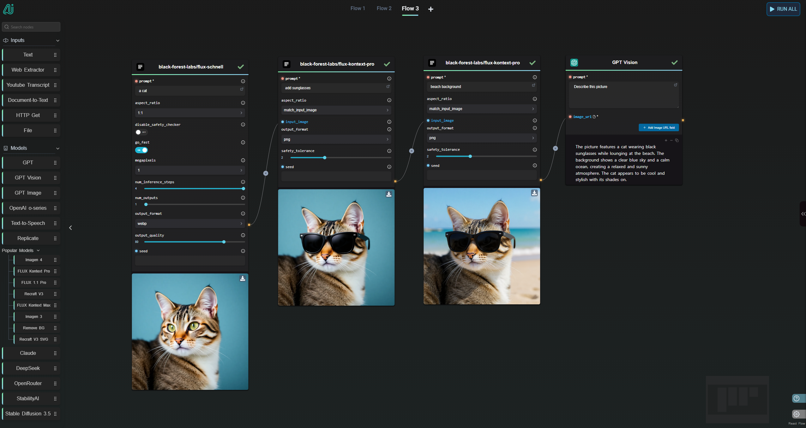
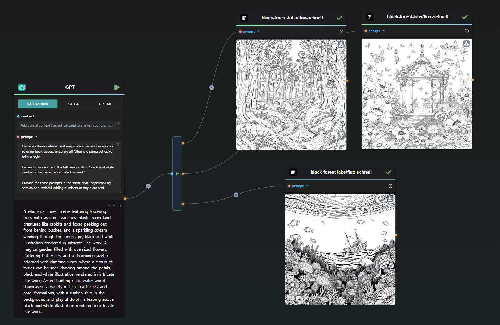

<p align="center">
  
</p>

<p align="center">
  <em>Open-source tool to seamlessly connect multiple AI model APIs into repeatable workflows.</em>
</p>

<p align="center">
  <a href="https://docs.ai-flow.net/?ref=github"></a>
  <a href="https://docs.ai-flow.net/?ref=github"></a>
  
  
  <a href="https://twitter.com/DahnM20"></a>
</p>

<p align="center">
  <a href="https://ai-flow.net/?ref=github">🔗 Website</a> • 
  <a href="https://docs.ai-flow.net/?ref=github">📚 Documentation</a>
</p>

---

<div align="center">
  🎉🚀 Latest Release: v0.11.3 🚀🎉

  <br>
  Nodes Updated : Web search can be enabled on GPT node, Claude 4 available
  <br>
  UI : Node Search Bar, Shortcut for Popular Replicate Models
  
  <br>
  New Models available : Flux Kontext, Veo 3, Lyria 2, Imagen 4 available through the Replicate Node
</div>

---



## Overview

**AI-Flow** is an open-source, user-friendly UI that lets you visually design, manage, and monitor AI-driven workflows by seamlessly connecting multiple AI model APIs (e.g., OpenAI, StabilityAI, Replicate, Claude, Deepseek).

## Features

- **Visual Workflow Builder:** Drag-and-drop interface for crafting AI workflows.
- **Real-Time Monitoring:** Watch your workflow execute and track results.
- **Parallel Processing:** Nodes run in parallel whenever possible.
- **Model Management:** Easily organize and manage diverse AI models.
- **Import/Export:** Share or back up your workflows effortlessly.

## Supported Models

- **Replicate:** All models available through the Replicate API (FLUX.1, FLUX.1 Kontext, Imagen 4, Veo 3, Lyria 2, and many more)
- **OpenAI:** GPT-4o, GPT-4.1, TTS, o1, o3, o4.
- **StabilityAI:** Stable Diffusion 3.5, SDXL, Stable Video Diffusion, plus additional tools.
- **Others:** Claude, Deepseek, OpenRouter.



## Open Source vs. Cloud

**AI-Flow** is fully open source and available under the MIT License, empowering you to build and run your AI workflows on your personal machine.

For those seeking enhanced functionality and a polished experience, **AI-Flow Pro** on our cloud platform ([app.ai-flow.net](https://ai-flow.net/?ref=github)) offers advanced features, including:

- **Subflows & Loops:** Create complex, nested workflows and iterate tasks effortlessly.
- **API-Triggered Flows:** Initiate workflows via API calls for seamless automation.
- **Integrated Services:** Connect with external services such as Google Search, Airtable, Zapier, and Make.
- **Simplified Interface:** Transform workflows into streamlined tools with an intuitive UI.


The cloud version builds upon the foundation of the open-source project, giving you more power and flexibility while still letting you use your own API keys.

## Installation

> **Note:** To unlock full functionality, AI-Flow requires S3-compatible storage (with proper CORS settings) to host resources. Without it, features like File Upload or nodes that rely on external providers (e.g., StabilityAI) may not work as expected. Also, set `REPLICATE_API_KEY` in the App Parameters or in your environment to use the Replicate node.

### Method 1: Using the Executable (Windows Only)

> **Note:** This method is only available for Windows users.

1. Download the latest Windows version of AI-Flow from the official releases page: [AI-Flow Releases](https://ai-flow.net/release/)
2. Once downloaded, run the `.exe` file.

This will start a local server and open AI-Flow in a standalone window, giving you direct access to its user interface without needing to install anything else.

### Method 2 : Docker Installation

1. **Prepare Docker Compose:**

   - Navigate to the `docker` directory:
     ```bash
     cd docker
     ```

2. **Launch with Docker Compose:**
   ```bash
   docker-compose up -d
   ```
3. **Access the Application:**
   - Open [http://localhost:80](http://localhost:80) in your browser.
   - To stop, run:
     ```bash
     docker-compose stop
     ```

### Method 3 : Local Installation

1. **Clone the Repository:**

   ```bash
   git clone https://github.com/DahnM20/ai-flow.git
   cd ai-flow
   ```

2. **UI Setup:**

   ```bash
   cd packages/ui
   npm install
   ```

3. **Backend Setup:**

   ```bash
   cd ../backend
   poetry install
   ```

   - **Windows Users:**
     ```bash
     poetry shell
     pip install -r requirements_windows.txt
     ```

4. **Run the Application:**
   - Start the backend:
     ```bash
     poetry run python server.py
     ```
   - In a new terminal, start the UI:
     ```bash
     cd packages/ui
     npm start
     ```
   - Open your browser and navigate to [http://localhost:3000](http://localhost:3000).

## Contributing

We welcome contributions! If you encounter issues or have feature ideas, please [open an issue](https://github.com/DahnM20/ai-flow/issues) or submit a pull request.

## License

This project is released under the [MIT License](LICENSE).
